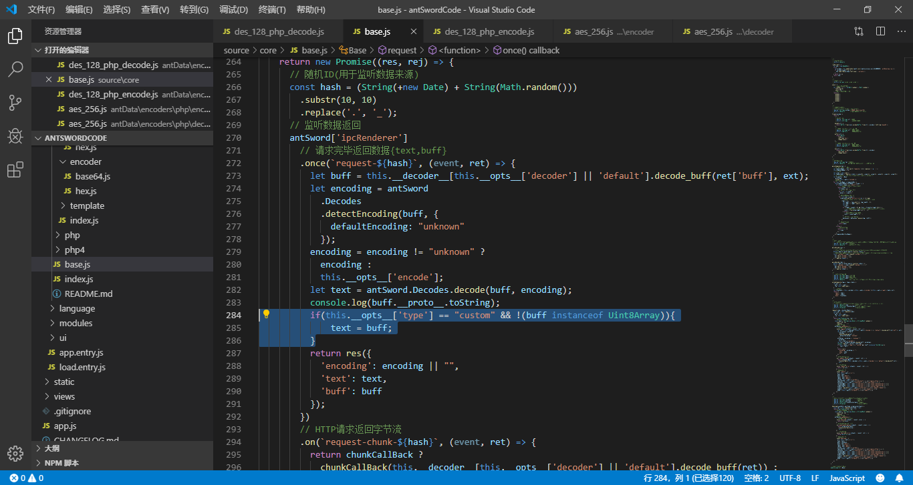

# OtherAntSwordAESEncoder
> 蚁剑 CUSTOM AES编/解码器,弥补蚁剑其他 Shell 没有强加密算法的缺陷。
>
> 原项目地址：https://github.com/Ch1ngg/CaidaoMitmProxy

## 支持类型
1. ASPX
2. JSP
3. JSPX
4. PHP(DES)

## 如何使用

1. 在本仓库找到你喜欢编码器/解码器

打开 AntSword, 进入「系统设置 」-> 「编码管理」

2. 点击「新建」, 然后输入你的编码器名称

3. 鼠标左键点击新建好的编码器，再点击工具栏中的「编辑」按钮。

4. 在弹出的编辑框里粘贴第1步中的代码，并点「保存」


## BUG

1. CUSTOM 脚本使用 AES 加解密且中文乱码官方暂时无解决方案，可使用临时修复方法。

## 临时修复方法

> 1. 在 \source\core\base.js 284行下方增加一行代码

```js
if(this.__opts__['type'] == "custom" && !(buff instanceof Uint8Array)){
          text = buff;
}
```



## 注意事项

* 某些编码器仅适用于某一特定 Shell, 在使用前可查看代码中注释部分或者同级目录是否有Shell目录，如无特殊说明则表示通用

## 感谢
> 感谢AntSword这个伟大的项目


[AntSwordProject](https://github.com/AntSwordProject)
## LICENSE

[LICENSE](./LICENSE)
## 法律
该项目仅供学习和测试，请各位遵守《中华人民共和国网络安全法》。禁止使用该项目进行违法操作，一切违法操作本人不承担任何法律责任！